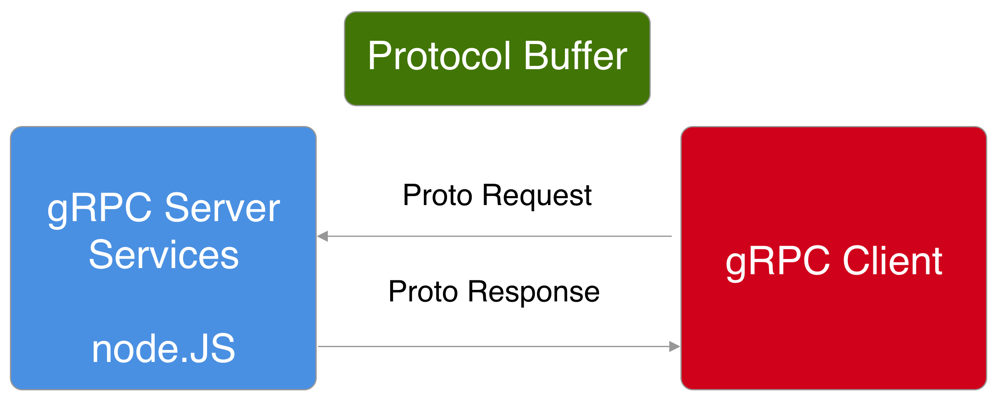

# Using GRPC with NodeJS
An Example showing how to use gRPC-js with NodeJS. This is a simple unary RPC call.

Client sends a Request Message to the Server. The Server processes the request and then sends a Response message back to the Client.



## Dependencies:
- @grpc/proto-loader
- grpc

## Running the Server 

```bash
node server.js
```

## Running the Client

```bash
node client.js
```

## Sample data
```js
let employees = [
  {
    id: 1,
    email: "abcd@abcd.com",
    firstName: "First1",
    lastName: "Last1",
  },
```

## Protocol buffer
Protocol Buffer is the Interface Definition Language which is used by default in GRPC.

- Defining the various services on the server server.
- Defining the Structure of the payloads.


```proto
syntax = "proto3";

package employee;

service Employee {

  rpc getDetails (EmployeeRequest) returns (EmployeeResponse) {}
}


message EmployeeRequest {
  int32 id = 1;
}

message EmployeeResponse{
  EmployeeDetails message = 1;
}
message EmployeeDetails {
  int32 id = 1;
  string email = 2;
  string firstName = 3; 
  string lastName = 4;
}
```

## Server


## Client